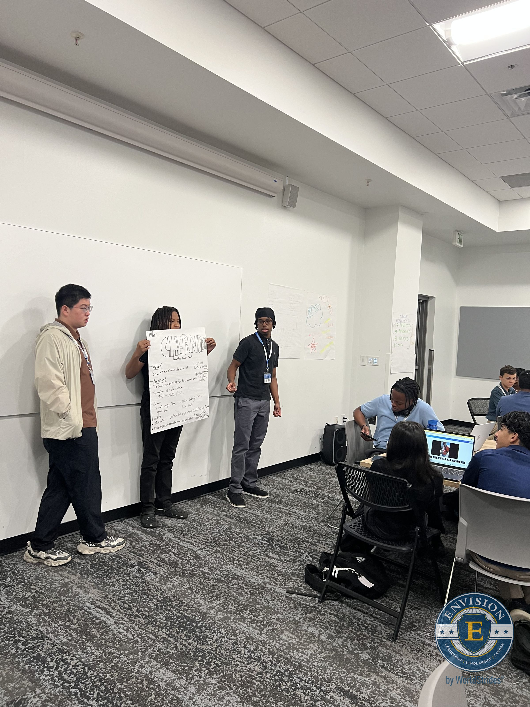
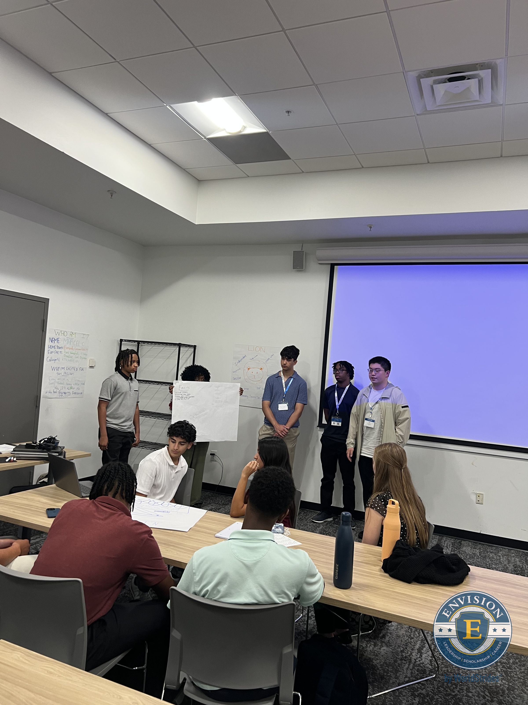
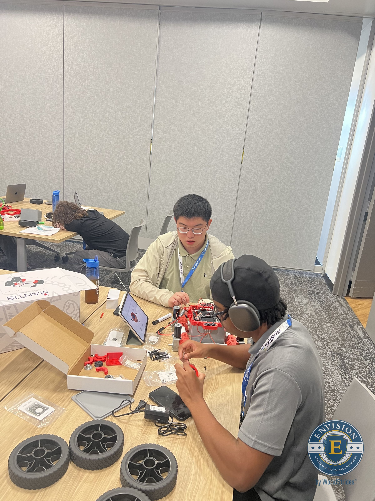
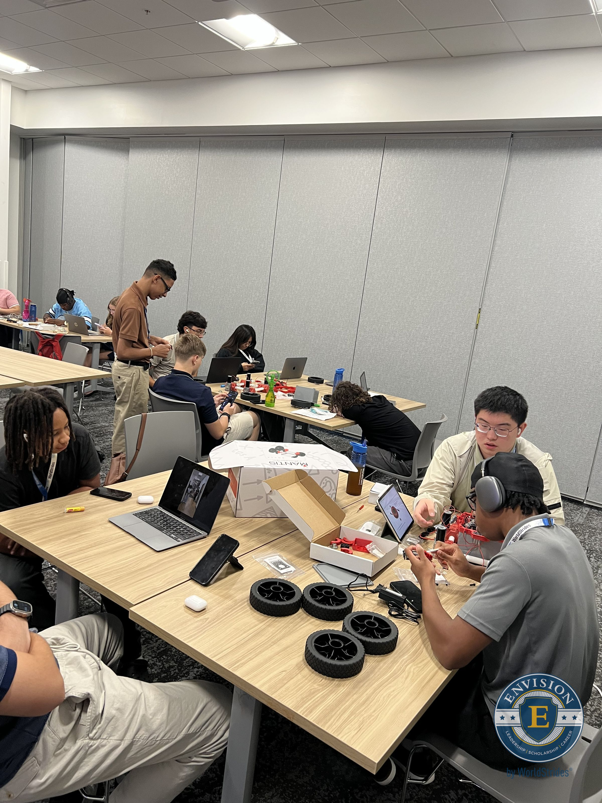
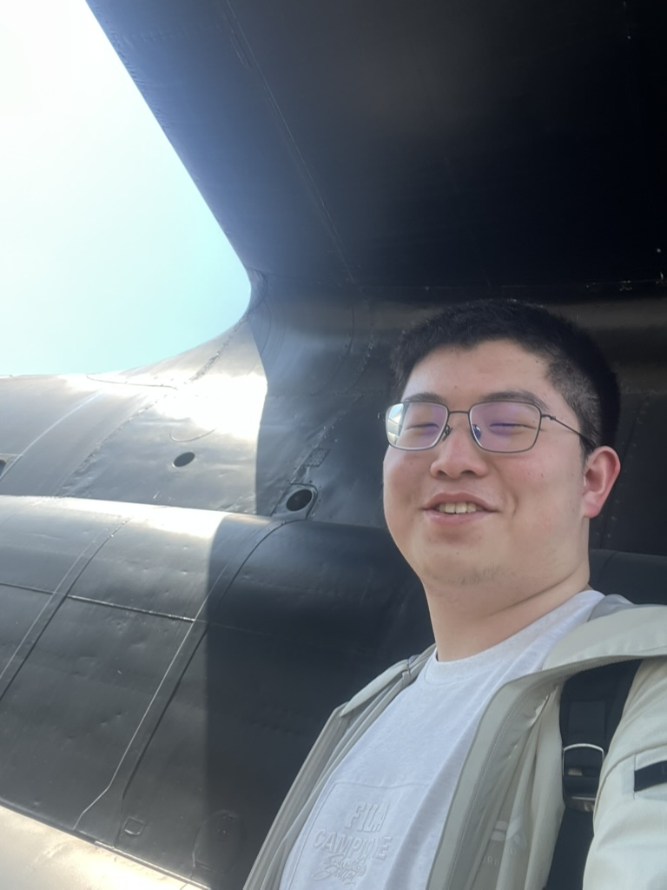
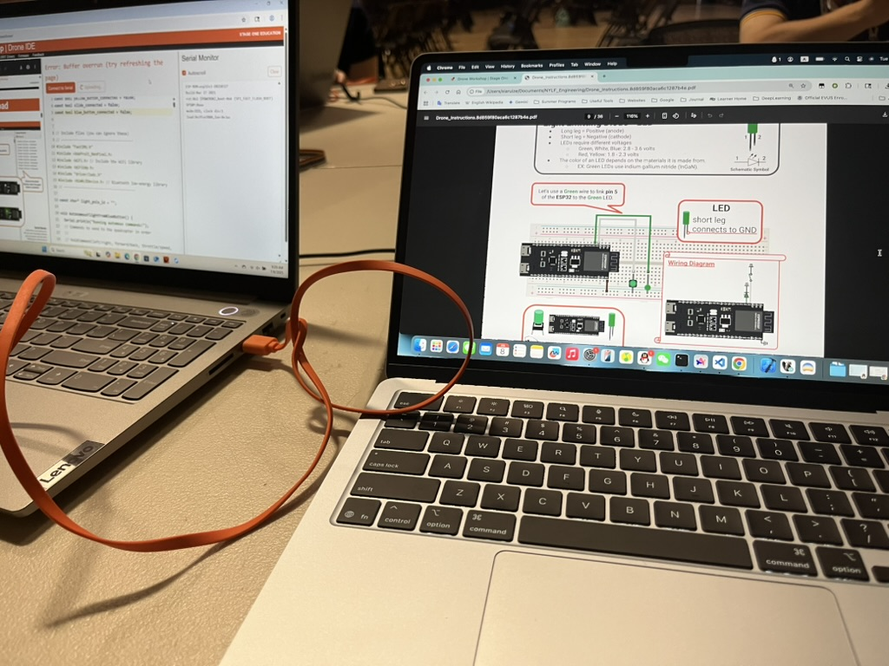
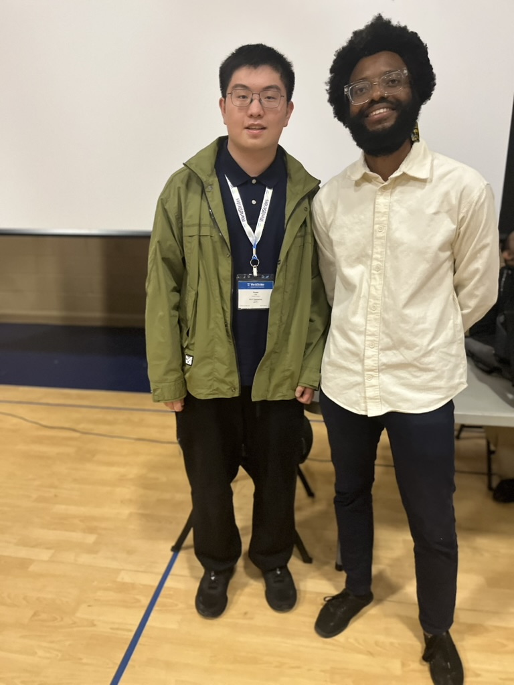

## Residential Engineering Program — Georgia Tech University

I attended the **NYLF Engineering Residential Program** at **Georgia Tech University** in Atlanta from **July 5–12, 2025**, where I worked in a collaborative cohort-based environment centered on engineering design, prototyping, leadership, and communication.

Over the course of the week, the program combined technical workshops, team challenges, speaker sessions, and a capstone process that moved from early problem definition to final presentation.

## Program highlights

- **Capstone design work:** Participated in the multi-day capstone sequence, including project introduction, define-and-ideate sessions, dedicated build time, and final presentation.
- **Engineering workshop rotations:** Completed four workshop rotation blocks focused on hands-on engineering problem solving and applied technical thinking.
- **Robotics workshop experience:** Took part in two extended robotics workshop sessions, building and testing systems in a team setting.
- **Engineering ethics and communication:** Engaged with sessions on **Ethics in Engineering**, **Public Speaking**, and collaborative team activities that emphasized responsible innovation and clear presentation.
- **University and career exposure:** Attended an admissions briefing, graduate student panel, speaker series events, a campus tour, and an engineering-focused offsite experience.

## What I gained

This experience strengthened both my technical confidence and my ability to work through open-ended problems with others. The most valuable parts of the week were:

- learning how engineering projects move from idea formation to presentation,
- collaborating under time constraints with new teammates,
- connecting technical design with ethics and communication,
- and seeing how university engineering environments support experimentation, iteration, and leadership.

The program gave me a more concrete sense of how engineering is practiced not just as theory, but as teamwork, systems thinking, and responsible decision-making.

## Moments from the program

