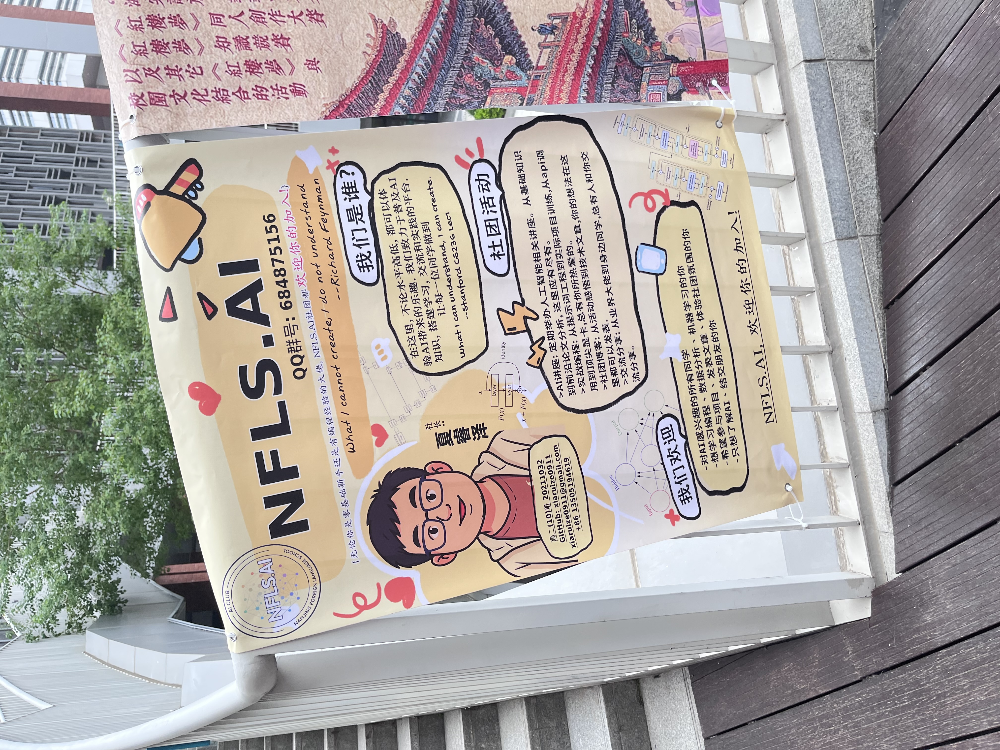

The NFLS AI Club made its public debut at Nanjing Foreign Language School's annual club fair. As President, I set up the booth to introduce students to what the club is about — and, just as importantly, why it exists.

The pitch was simple: artificial intelligence is already part of how you study, search, write, and communicate. The question is whether you want to understand it, or just use it.

## What We Presented

At the booth, we walked curious students through the club's focus areas:

- **Technical skill** — building real models, understanding real mathematics, writing real code in Python and PyTorch
- **Critical thinking** — reading and discussing how AI systems affect fairness, privacy, education, and social life
- **Community** — a group where asking *"but why does this work?"* is more valued than just getting the code to run

We also showed some live demos: an interactive visualization of how a neural network classifies data, and a quick walk through what gradient descent actually looks like as a curve descending toward a minimum.

## Photos

## Who Joined

The response exceeded expectations. Students came with very different motivations — some wanted to learn to code properly, some had already fine-tuned models and wanted deeper math, some came specifically because they were thinking about fairness and wanted a community that took those questions seriously.

That range is exactly right. The club's job isn't to produce one kind of AI person. It's to build a room where different kinds of curiosity strengthen each other.

New members were onboarded and the first official meeting was scheduled for later in September.
