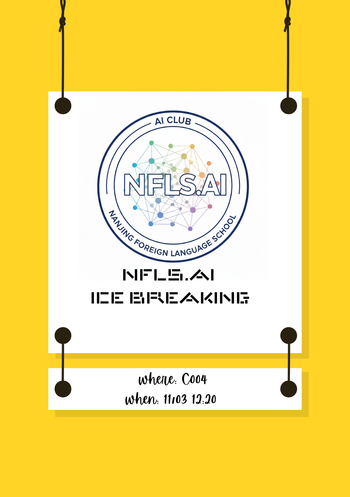
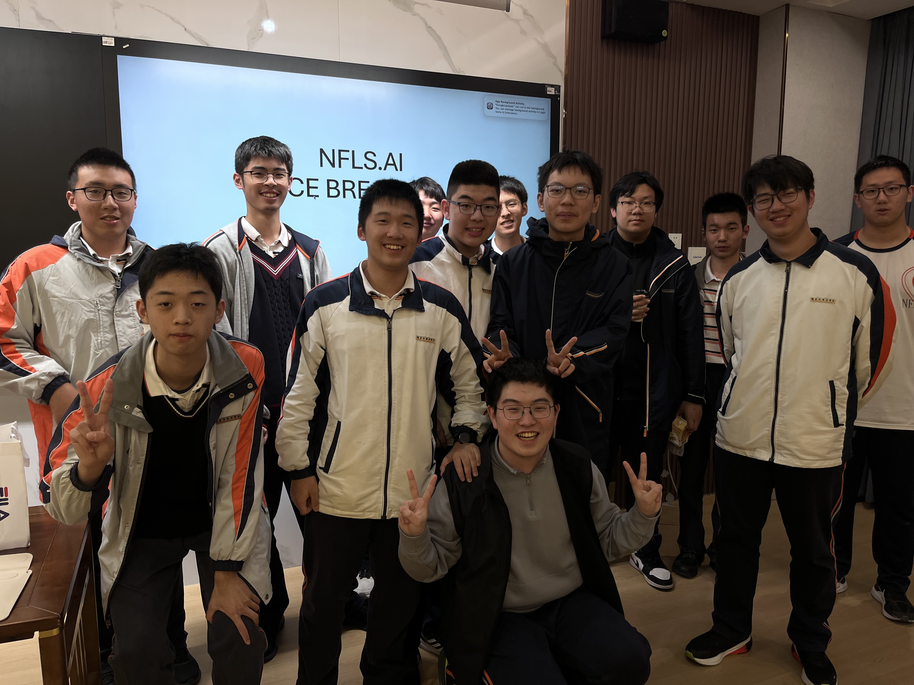
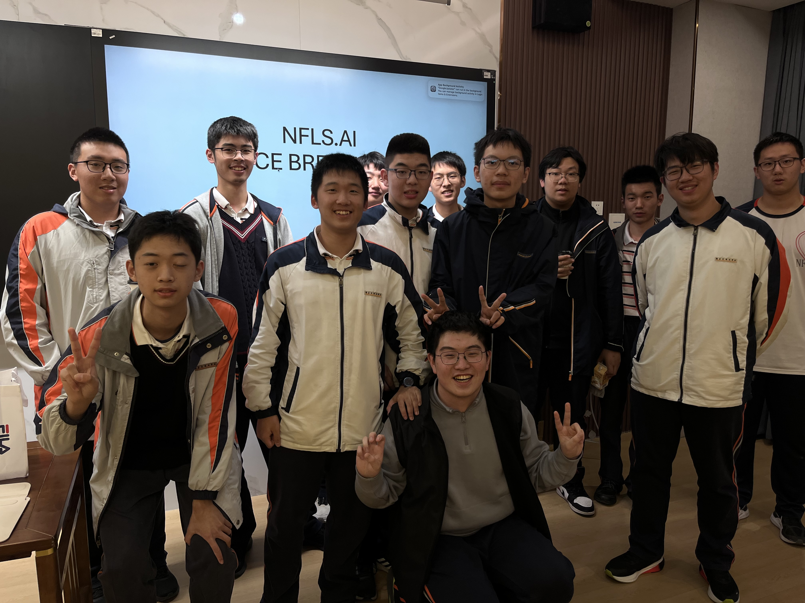
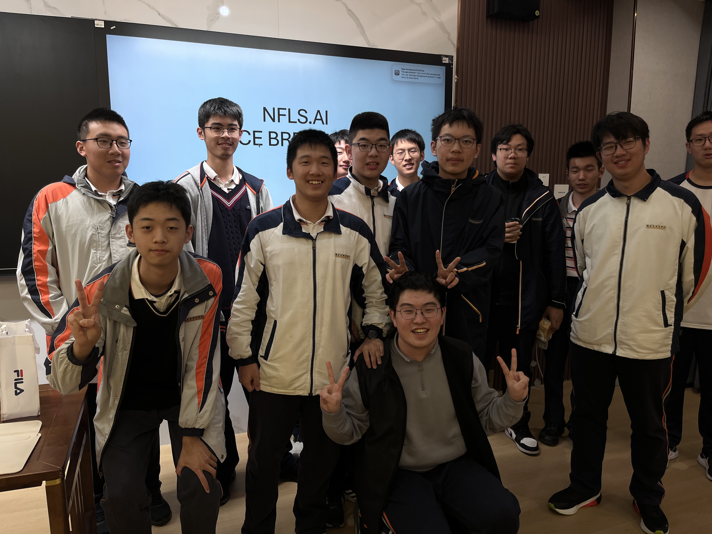
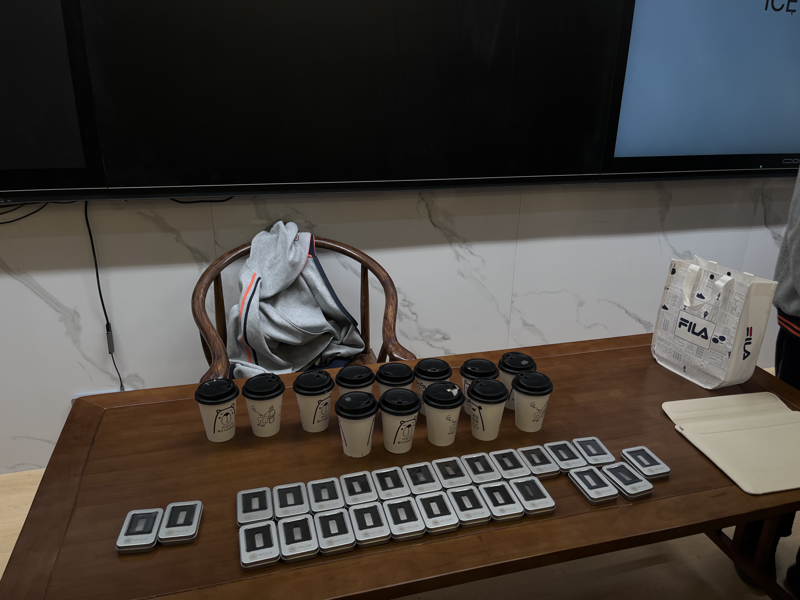
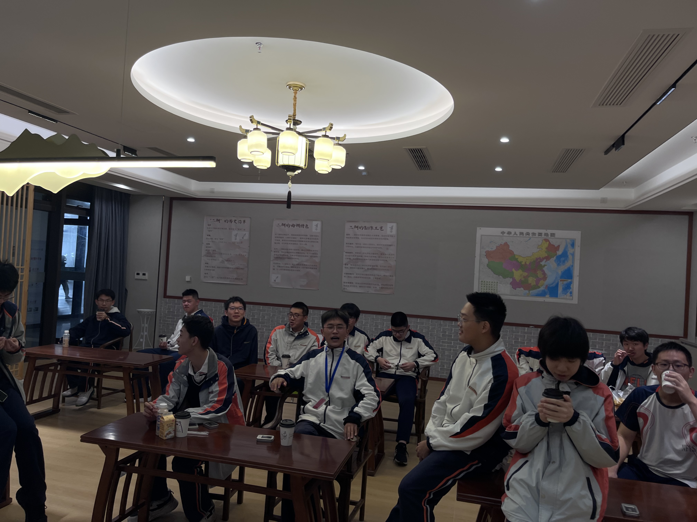
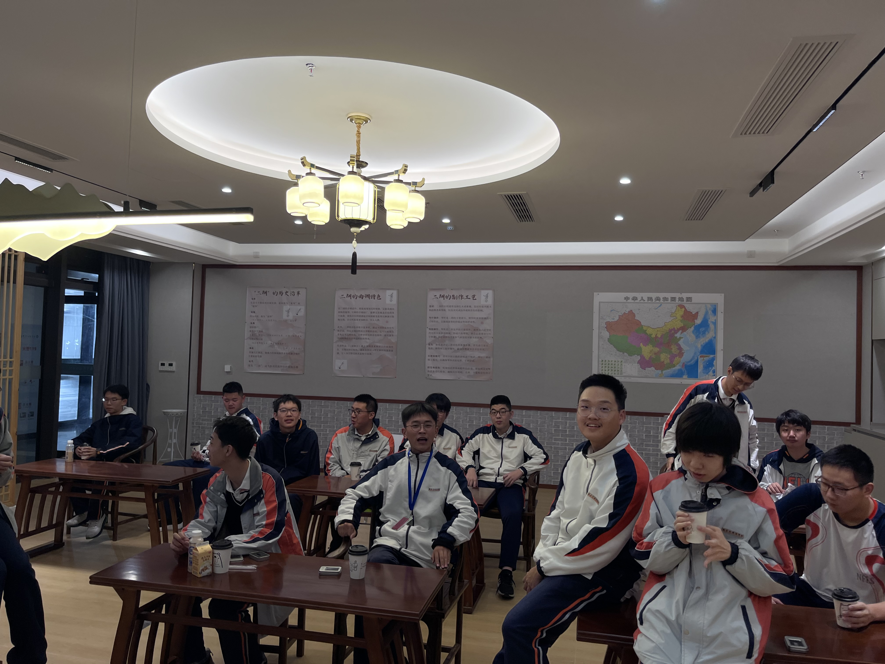
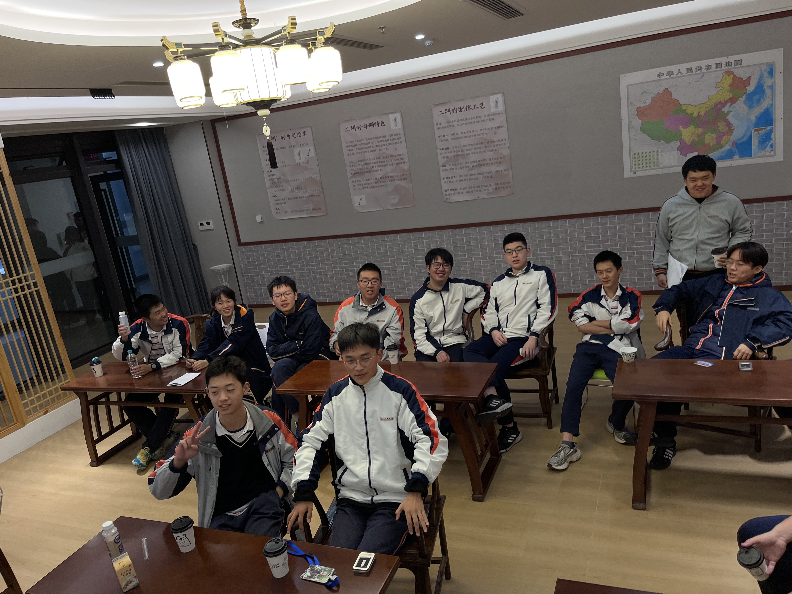
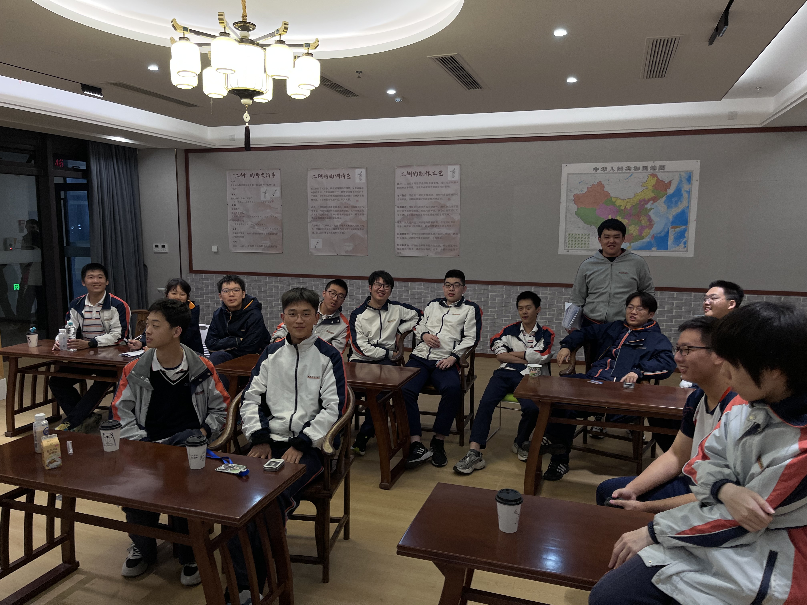
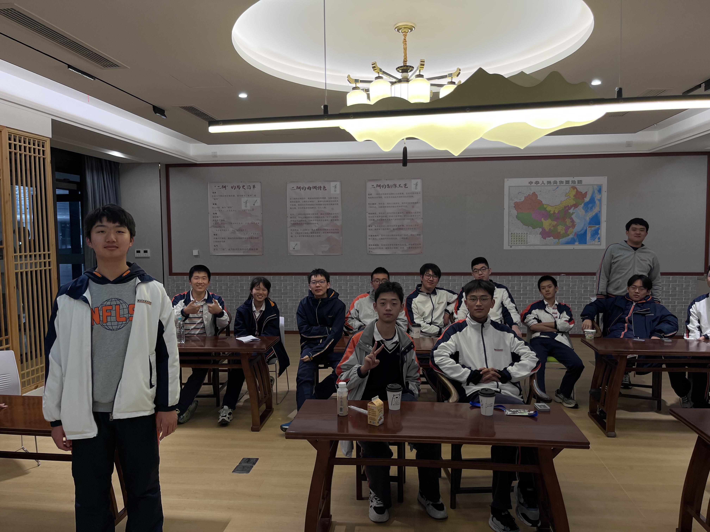

The first official meeting of the NFLS AI Club brought together new recruits and returning members for a structured ice-breaking session. As President, I designed the activity to accomplish two things at once: help everyone meet each other, and surface the very different reasons students are drawn to AI. Those two goals turned out to be the same thing.

## Opening: The question on the table

Each member introduced themselves with a short answer to the same prompt:

> *"What brought you here — and what do you hope to learn or make?"*

The answers ranged widely. Some students wanted to understand what ChatGPT was actually doing under the hood. Others had heard about AI transforming industry and wanted to get ahead of it. A few came with specific project ideas already sketched out. Several mentioned, with some directness, that they were troubled by things they had read about AI and wanted a space to think them through.

That diversity is intentional. A club that is only a coding group misses the point. A club that is only a discussion group misses a different point. NFLS AI Club is designed to hold both.

## Activity: What AI did you see this week?

We broke into small groups around a single question: *"Name an AI system you encountered in the past week — and explain, as precisely as you can, what you think it was doing."*

Groups identified recommendation algorithms, autocomplete in search and messaging, spam filters, image search, translation, and speech recognition. The conversation surfaced a gap that almost everyone recognized: AI is everywhere in daily life, but most of us interact with it without understanding the mechanism. That gap — between fluent use and real comprehension — is exactly the gap the club addresses.

## Club structure walkthrough

After the group activity, I walked new members through how the club is organized:

- **Weekly workshops** — covering machine learning mathematics, neural network architectures, and practical PyTorch coding
- **Reading and discussion** — examining AI's role in education, governance, fairness, and society; drawing on both technical papers and public writing
- **Project track** — members who want to work on independent or group projects can build and present throughout the semester

The tone I tried to establish was this: this is a place where not knowing something is not a problem. The problem would be pretending to know, or not bothering to ask.

## Photos

## What came next

The ice-breaking session confirmed that the club had the right membership: people who were both technically curious and willing to slow down and ask harder questions. The next meeting was set as a full technical workshop — starting from scratch with the mathematics of neural networks, live visualization, and PyTorch code.

The ice was broken. The real work was ready to start.
