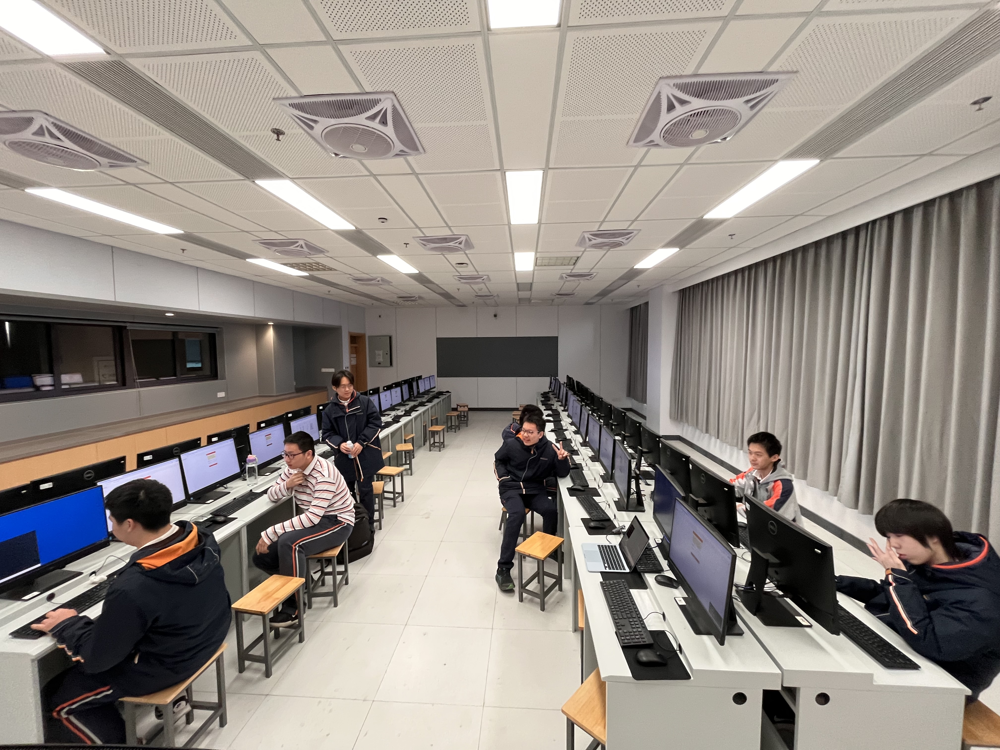
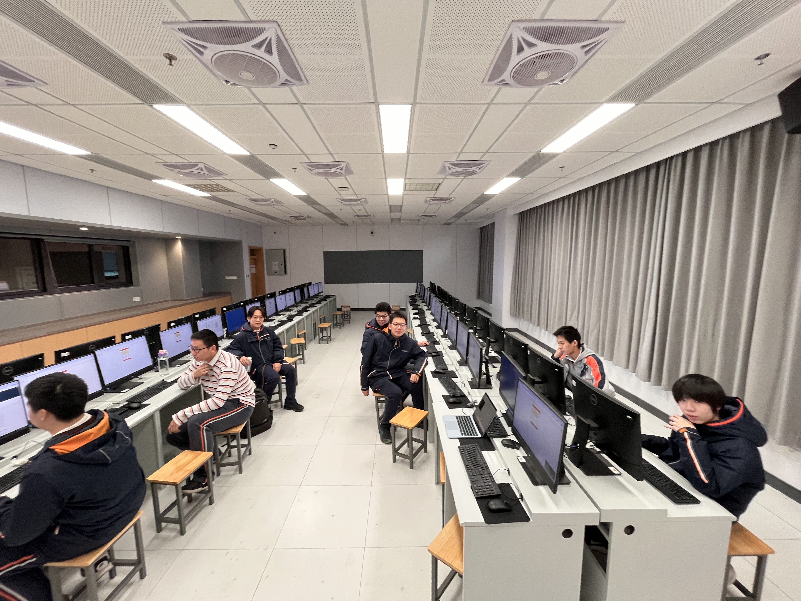
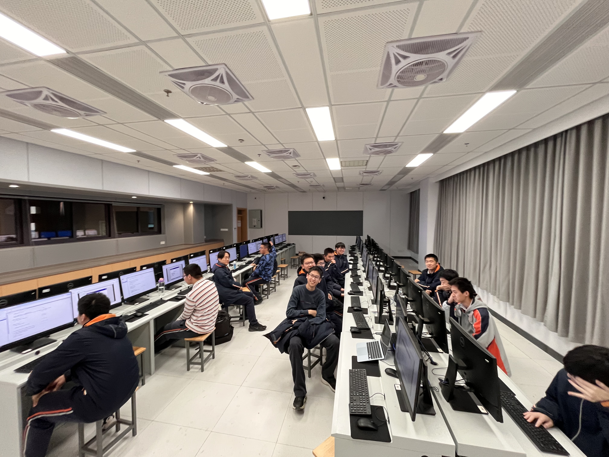
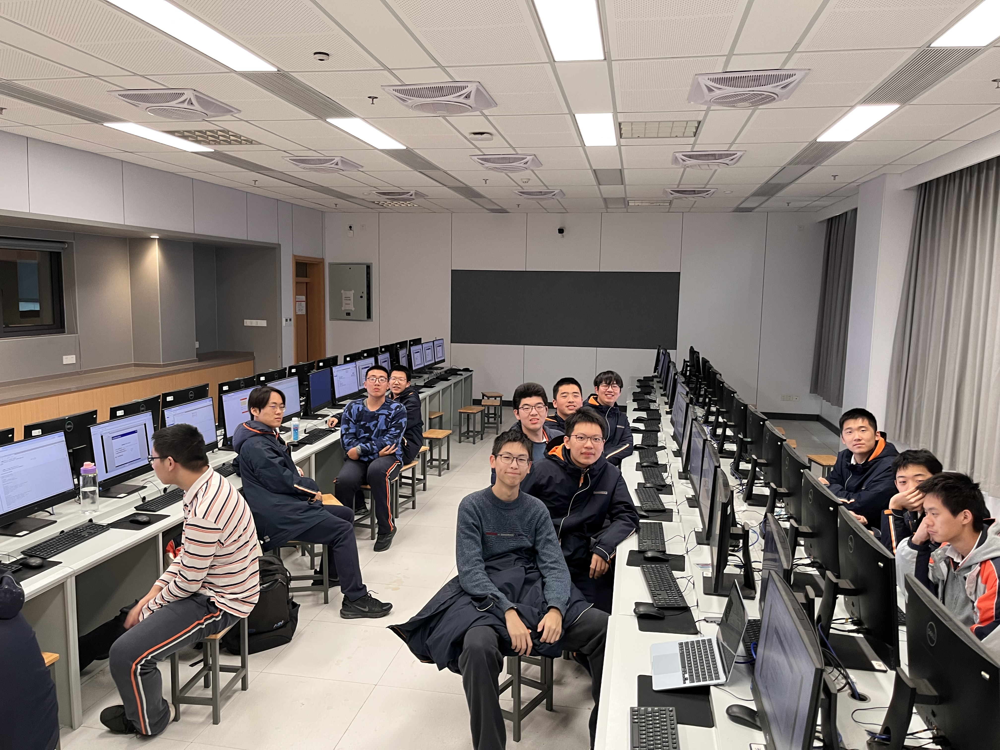
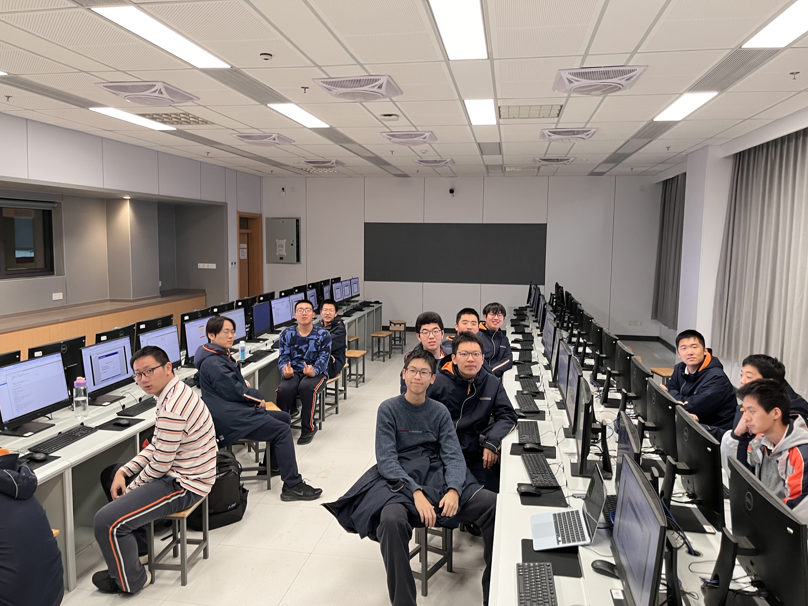
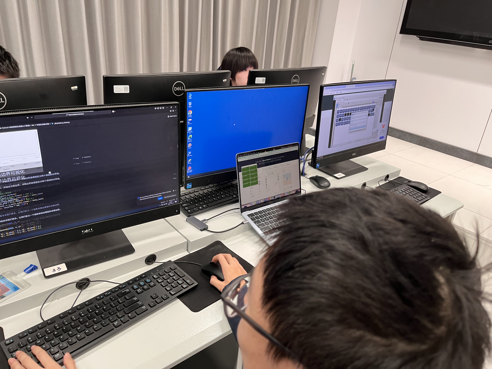

、
The second NFLS AI Club meeting was a focused technical session. The goal was specific and stated at the start:

> *"By the end of this meeting, you will not just know that neural networks work. You will understand why — down to the calculus."*

The session ran roughly 35 minutes, moving through four stages: live visual demonstration, mathematical explanation, direct code walkthrough, and a training run with real output.

**Tools used:** [TensorFlow Playground](https://playground.tensorflow.org) (live demo), PyTorch (code and training), Jupyter Notebook (shared with members after the session).

---

## Part 1 — The Limit of Linear Models (0:00–0:12)

The demo opened on TensorFlow Playground with the **Moons** dataset: two interleaved half-moon shapes, one blue, one orange. The task is to train a model that draws a boundary separating the two classes.

With all hidden layers removed, the model is mathematically a **logistic regression**. What it is searching for is a solution to:

$$z = w_1 x_1 + w_2 x_2 + b$$

In two dimensions, this equation represents a straight line. No matter how that line is rotated or shifted, it cannot enclose a curved shape. Running the model confirms this: the decision boundary wobbles endlessly and never correctly separates the data.

This is the **XOR problem** — the limitation that motivated the invention of neural networks in the first place. Linear models are blind to non-linear structure.



---

## Part 2 — Introducing Non-Linearity (0:12–0:20)

Adding one hidden layer with three neurons and a **ReLU** activation changes the result immediately.

Each neuron performs two operations in sequence:

1. **Linear transformation** — compute the weighted sum: $z = \mathbf{w} \cdot \mathbf{x} + b$
2. **Non-linear activation** — apply ReLU

The ReLU function is simple:

$$\text{ReLU}(x) = \max(0, x)$$

Positive values pass through unchanged. Negative values become zero. That asymmetry is the key: it gives the network the ability to "fold" the input space. A straight line pressed through ReLU becomes a bent one. Multiple neurons, each folding the space differently, can collectively approximate any curved boundary.

Running the model in Playground with the hidden layer active: the decision boundary curves, wraps around both half-moons, and achieves near-perfect separation within a few seconds.

**The core principle:** a neural network is a composition of linear transformations and non-linear activations, stacked until the network can model the complexity of the data.





---

## Part 3 — Code Walkthrough in PyTorch (0:20–0:30)

Switching to the Jupyter notebook, the session showed how each mathematical concept maps to code on screen.

### Building the network

```python
self.layer_1 = nn.Linear(in_features=2, out_features=10)
self.relu    = nn.ReLU()
self.layer_2 = nn.Linear(in_features=10, out_features=1)
self.sigmoid = nn.Sigmoid()
```

`nn.Linear(2, 10)` is matrix multiplication. The input $X$ is $N \times 2$; the weight matrix $W$ is $10 \times 2$. The layer computes $X \cdot W^T + b$, projecting the 2D coordinate into a 10-dimensional space. The following `nn.ReLU()` applies $\max(0, x)$ element-wise, breaking the linearity.

Without the activation function, stacking any number of `nn.Linear` layers is algebraically equivalent to a single linear operation, no matter how deep the network. Activation functions are not decoration — they are the source of everything.

### Loss function

```python
criterion = nn.BCELoss()
```

Binary Cross-Entropy measures the gap between the predicted probability and the true label:

$$L = -\left[y \log \hat{y} + (1 - y) \log(1 - \hat{y})\right]$$

When $\hat{y}$ is close to $y$, the loss is near zero. When they diverge, the loss grows sharply. This gives the optimizer a precise signal about how wrong the current weights are.



---

## Part 4 — Training Loop and Backpropagation (0:30–0:38)

```python
optimizer.zero_grad()   # clear old gradients
outputs = model(X)      # forward pass
loss    = criterion(outputs, y)
loss.backward()         # backpropagation
optimizer.step()        # update weights
```

These five lines implement the entire training process. The key is `loss.backward()`.

**Backpropagation** applies the chain rule from calculus to automatically compute $\frac{\partial L}{\partial W}$ for every weight in the network. The gradient $\nabla W$ answers the question: *if I increase this weight slightly, does the loss go up or down?*

**Gradient descent** then updates every weight in the direction of lower loss:

$$W_{\text{new}} = W_{\text{old}} - \alpha \cdot \nabla W$$

The learning rate $\alpha$ controls the step size. Too large and the updates overshoot, causing divergence. Too small and convergence takes thousands of extra iterations. Finding the right balance is part of the craft of training.

Running the training loop for 1000 iterations: the loss drops from ~0.70 to ~0.05. The final boundary visualization is curved and precise — identical in shape to what Playground produced, but generated entirely by the math and code members had just written themselves.






---

## Summary

By the end of 35 minutes, members could:

1. Explain why linear models fail on non-linear data, with a concrete example
2. Describe what ReLU does geometrically — space-folding, not just thresholding
3. Map `nn.Linear`, `nn.ReLU`, `nn.BCELoss`, and the training loop directly onto the underlying mathematics
4. Interpret a descending loss curve as parameter convergence, not just a number going down

The Jupyter notebook was distributed to every member after the session. The recommended exercise: change the number of neurons in the hidden layer, try a harder dataset (e.g. Spirals), and observe directly how architecture choices affect both the shape of the learned boundary and the training dynamics.

Neural networks are often described as black boxes. They aren't. They are a sequence of clear, beautiful mathematical operations. Once the math is visible, the code becomes obvious — and so do the limits.

---

*Workshop materials: activity script, LaTeX slides, and Jupyter notebook produced by the NFLS AI Club.*
