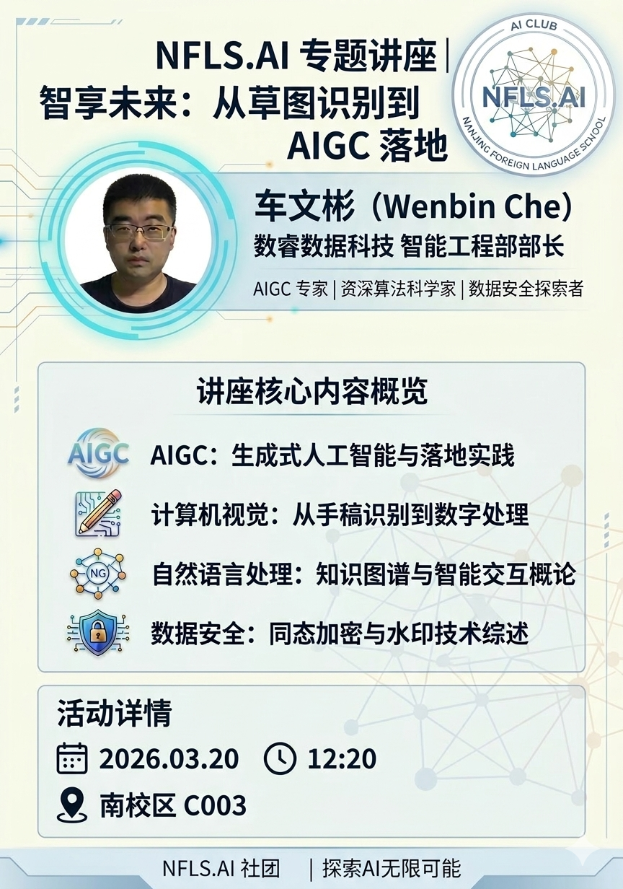
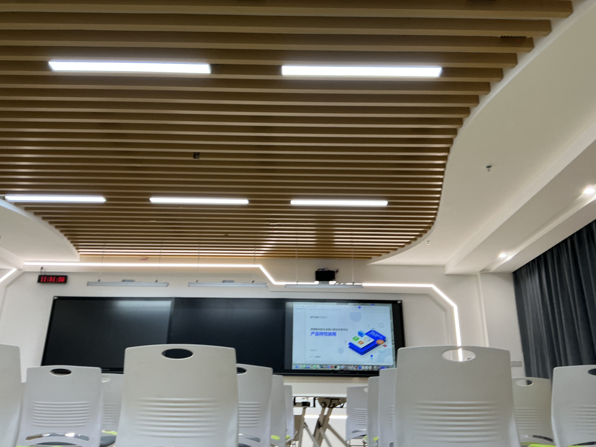
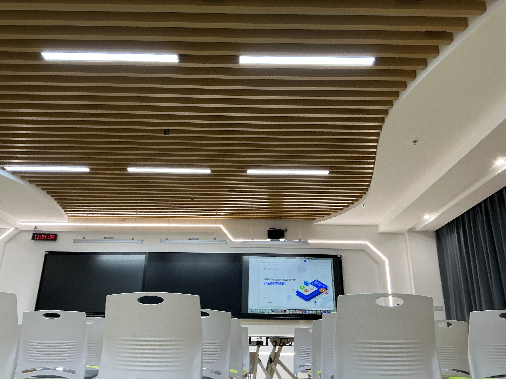
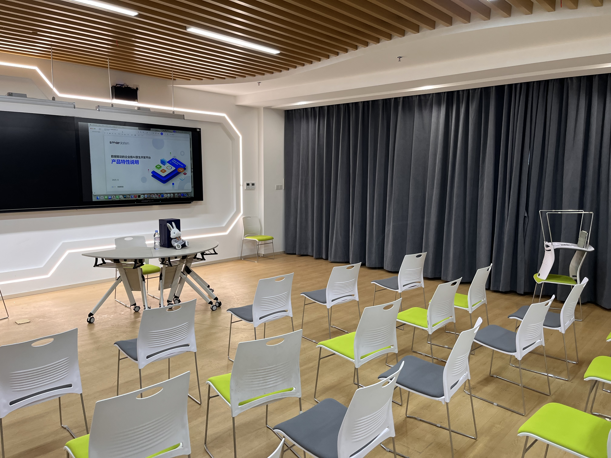
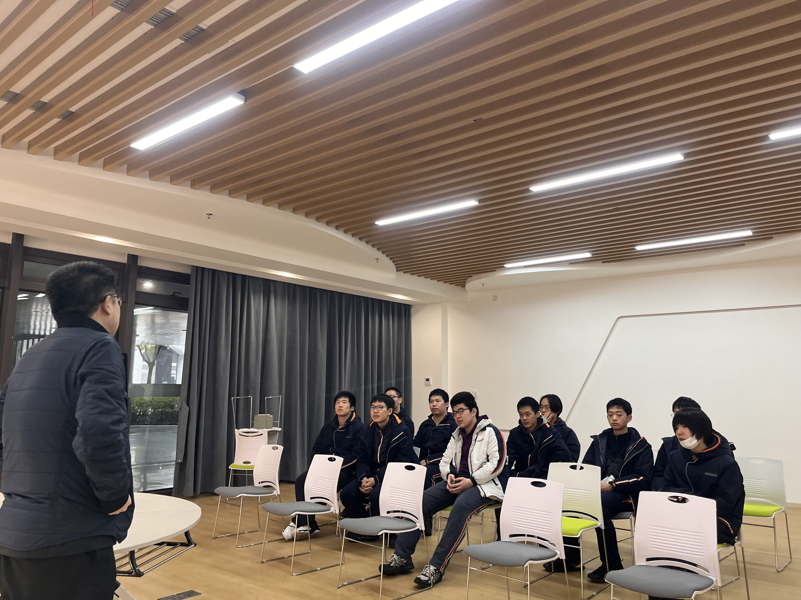
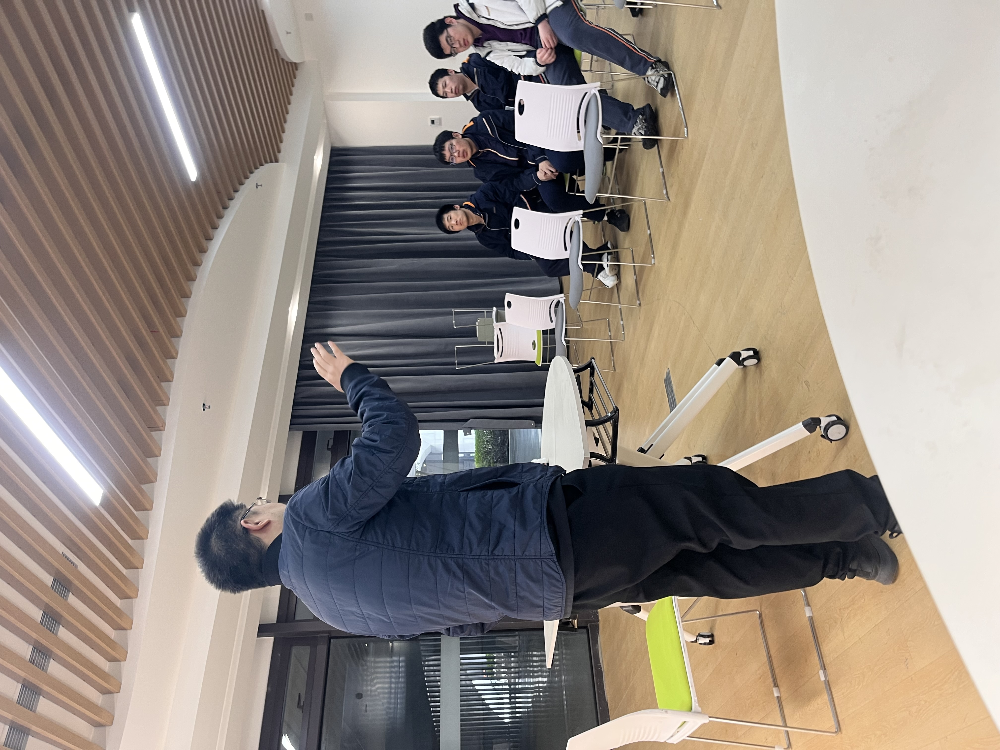
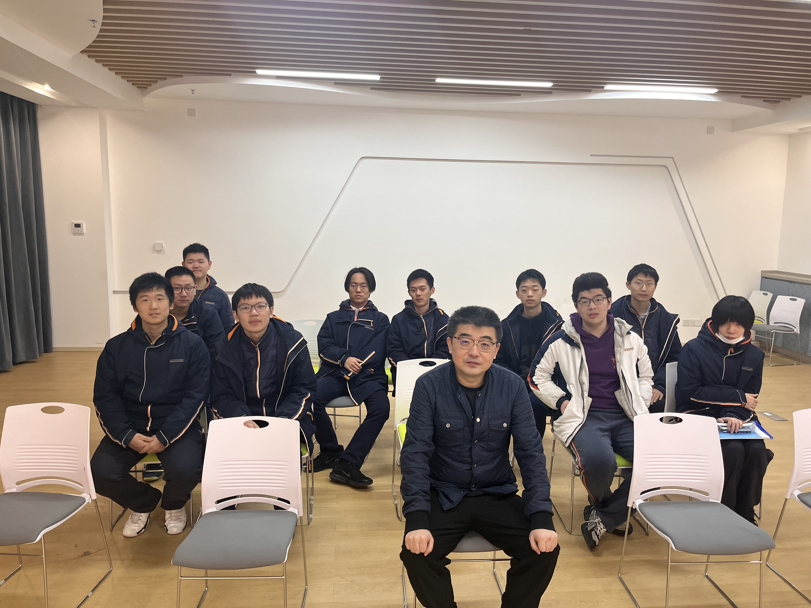
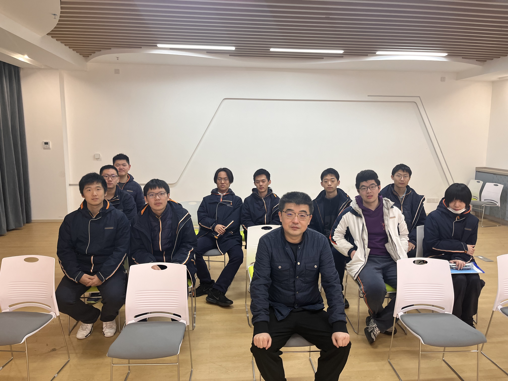
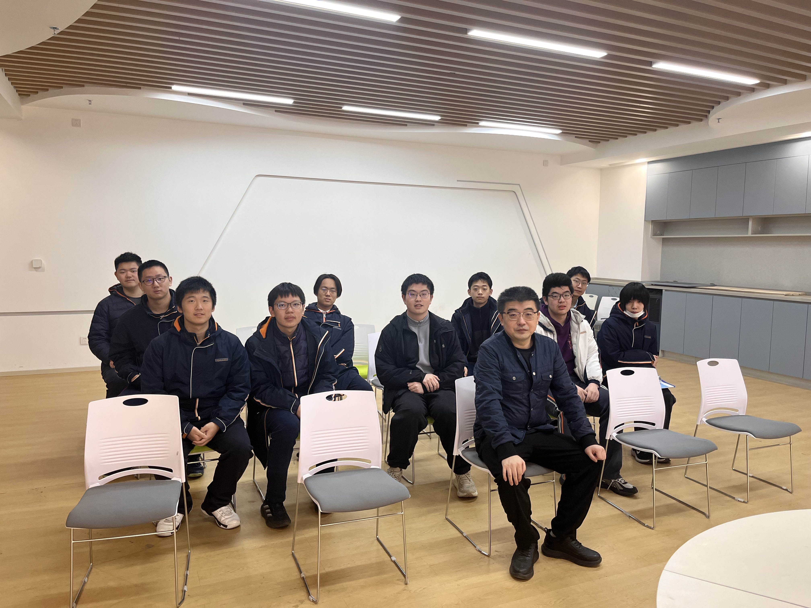
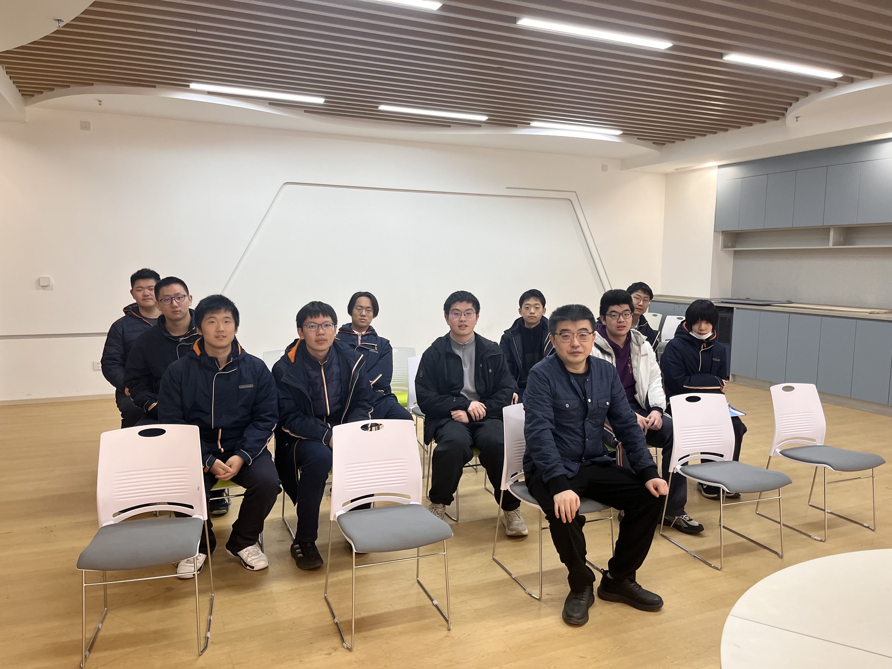

The third NFLS AI Club meeting shifted from student-led workshops to an invited industry lecture.

On **March 20, 2026**, we hosted **Dr. Che Wenbin (车文彬博士)**, identified in the club activity record as the head of intelligent engineering at **Shurui Data (数睿数据)**. As President of the club, I organized the session as a chance for members to see how ideas from computer vision, language models, and multimodal AI move from research demos into practical engineering systems.

The talk's theme was:

## From Sketch Recognition to AIGC: Industrial AI in Practice

That title captured exactly what made the session valuable. Earlier club activities focused on foundations — what neural networks are, how they learn, and how students can reason about them mathematically. This session expanded the frame. It showed what happens after the theory: when AI has to operate inside products, workflows, compute limits, and business constraints.

## What the lecture covered

According to the club activity form and record, the lecture centered on three closely connected areas:

- **Computer Vision (CV)** — including practical image-recognition tasks and real visual AI pipelines
- **Natural Language Processing (NLP)** — connecting language technologies to deployable tools and services
- **Large Language Models and multimodal systems** — especially the kinds of scenarios where LLMs and cross-modal understanding become useful in production environments

One of the strongest aspects of the session was that it stayed grounded in **real engineering practice**. Instead of treating AI as a collection of abstract model names, the lecture focused on where these systems succeed, what tradeoffs they force, and what must be balanced when deploying them beyond the lab.

## Why this meeting mattered

For club members, this lecture opened an important perspective.

In school settings, AI is often encountered either as theory or as consumer products. What this session added was the middle layer: **implementation in the real world**. Members got to see how industrial AI work involves not just designing models, but also making decisions about:

- accuracy versus efficiency,
- model capability versus compute cost,
- research novelty versus product reliability,
- and technical performance versus actual user value.

That bridge between classroom understanding and industrial deployment is exactly the kind of perspective I want NFLS AI Club to offer.

## Q&A and discussion

The activity record notes that the discussion section was especially active. Members asked about questions such as:

- how to balance **algorithmic precision** against **computational cost**,
- what kinds of AI skills are most valuable for future study,
- and how students should think about career paths in a rapidly changing AI landscape.

That kind of exchange matters as much as the lecture itself. A club becomes serious when members stop only absorbing information and start asking sharper questions about constraints, design choices, and the future direction of the field.

## Photos

## Takeaway

This meeting helped club members connect three layers of AI understanding:

1. **Theory** — the mathematics and concepts behind modern models
2. **Implementation** — the engineering work needed to make systems usable
3. **Application** — the practical environments where AI creates value and constraints at the same time

The result was exactly what the club hopes to create: not just excitement about AI, but a more mature understanding of what it takes to make AI work in the world.
